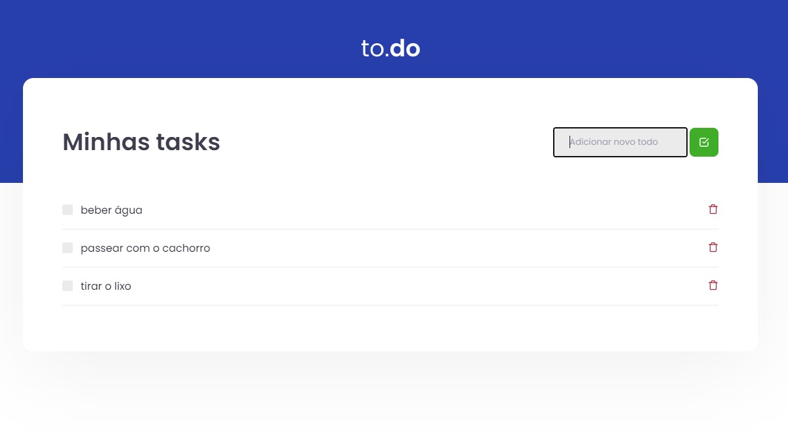

# ignite-reactjs-desafio01

# 💻 Sobre o desafio

Nesse desafio, você deverá criar uma aplicação para treinar o que aprendeu até agora no ReactJS

Essa será uma aplicação onde o seu principal objetivo é uma pequena aplicação de atividades a fazer, para treinar um pouco mais sobre manipulação do estado no React.

- Adicionar uma nova tarefa
- Remover uma tarefa
- Marcar e desmarcar uma tarefa como concluída

  

Feito com ❤️ por Daniel Braz 👋🏻 <a href="https://www.linkedin.com/in/drzbraz/">Linkedin</a>

